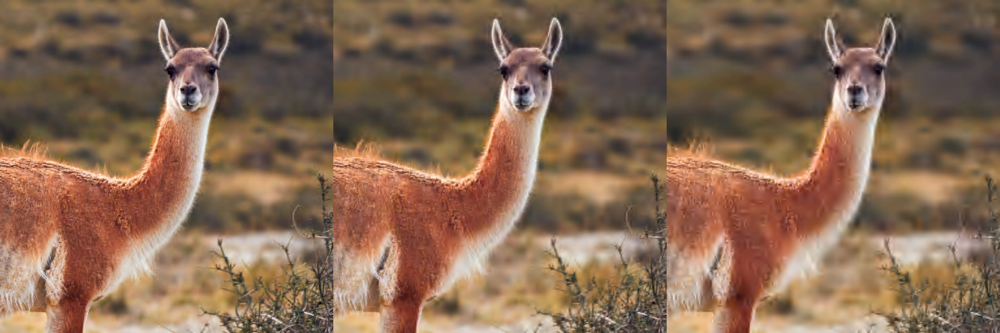
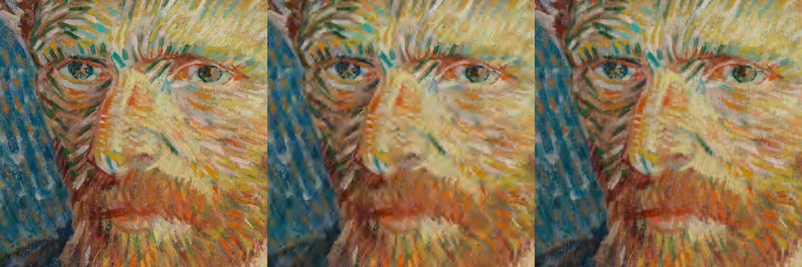

Ako
===

Image codec using discrete wavelet transform.

**A toy-project**. It is me learning how image codecs works, having fun following a bunch of papers. :)

It supports/implements:
- Deslauriers-Dubuc 13/7 wavelet.
- Up to 4 channels.
- 8 bits per component.
- YCoCg colorspace (can be disabled at compilation time).
- Configurable quality loss (examples below).
- Simple Elias-gamma entropy compression, nonetheless the codec can handle ratios of 1:10 before artifacts became obvious.
- A "good" performance. There is some care on cache and memory usage, and almost everything is done with integers... still there is space for improvement.


Compilation
-----------
Build requirements are [git][14] and [cmake][15] or [ninja][16]. As runtime dependency [libpng][17].

On Ubuntu you can install them with:
```
sudo apt install git ninja-build cmake libpng-dev
```

### Using Cmake
```
git clone https://github.com/baAlex/Ako
cd Ako
mkdir build
cd build
cmake -DCMAKE_BUILD_TYPE=Release ..
cmake --build .
```

### Using Ninja
```
git clone https://github.com/baAlex/Ako
cd Ako
ninja
```


Usage
-----
The two executables `akoenc` and `akodec` will let you try the codec. Run them whitout any argument to read the usage help. But is mostly:

```
akoenc -q 16 -i "input.png" -o "out.ako"
```
- Where `-q 16` is the quantization step that controls loss.
- There is also a noise gate, with `-n 16`, that can be used as a denoiser to help with compression. Is possible to use both, or disabled either one with a value of zero.


Examples
--------
Consider the following examples as mere illustrations, the codec is constantly improving, and compression ratios are too high to be useful in real life.

For most purposes the examples are good on showcase how a simple wavelet-based codec degrades images, and what kind of artifacts expect of it.
- Note that there is no blocks.
- And how fine details are lost while sharp lines and overall shapes remain somewhat intact. All codecs do this, but is remarkable since right now there is no analysis, quality estimation nor any rate-distortion optimization (tasks to improve the codec further).


- [Uncompressed][1] (2.76 MB), [**1:27**][2] (100.86 kB), [**1:60**][3] (46.02 kB), [**1:146**][4] (18.92 kB)
- Using quantization steps of: 16, 32 and 64


- [Uncompressed][5] (1.17 MB), [**1:15**][6] (78.27 kB), [**1:28**][7] (41.91 kB), [**1:60**][8] (19.62 kB)
- Using quantization steps of: 16, 32 and 64


- [Uncompressed][9] (7.14 MB), [**1:10**][10] (714.35 kB), [**1:44**][11] (163.46 kB), [**1:44**][12] (163.18 kB)
- Using quantization steps of: 2, 2 and 30
- With noise gate thresholds of: 16, 48 and 0
- Last two serve as comparison between a noise gate compression and a quantization compression, both set to an identical ratio


License
-------
Source code under MIT License. Terms specified in [LICENSE][13].

Each file includes the respective notice at the beginning.

____

[1]: ./test-images/guanaco1.png
[2]: ./resources/guanaco1.akoQ16N0.png
[3]: ./resources/guanaco1.akoQ32N0.png
[4]: ./resources/guanaco1.akoQ64N0.png

[5]: ./test-images/kodak8.png
[6]: ./resources/kodak8.akoQ16N0.png
[7]: ./resources/kodak8.akoQ32N0.png
[8]: ./resources/kodak8.akoQ64N0.png

[9]: ./test-images/vincent.png
[10]: ./resources/vincent.akoQ2N16.png
[11]: ./resources/vincent.akoQ2N48.png
[12]: ./resources/vincent.akoQ30N0.png

[13]: ./LICENSE

[14]: https://git-scm.com/
[15]: https://cmake.org/
[16]: https://ninja-build.org/
[17]: http://www.libpng.org/pub/png/libpng.html
