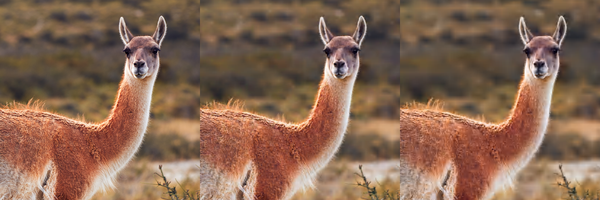
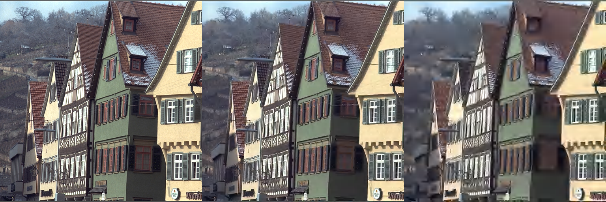
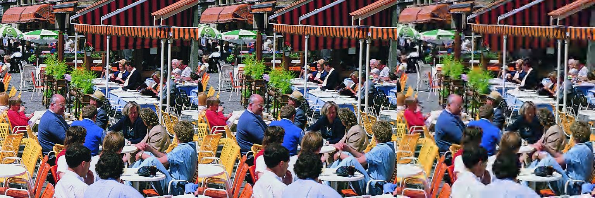

Ako
===

Image codec using discrete wavelet transform (CDF 5/3).

**A toy-project**. It is me learning how image codecs works, having fun following a bunch of papers. :)

It supports/implements:
- Image sizes power of two (4, 8, ..., 256, 512, 1024, etc.)
- Up to 4 channels.
- 8 bits per component.
- YCoCg colorspace (can be disabled at compilation time).
- Configurable quality loss (examples below).
- Simple Elias-gamma entropy compression, nonetheless the codec can handle ratios of 1:10 before artifacts became obvious.
- A "good" performance. There is some care on cache and memory usage, the CDF 5/3 wavelet is incredible simple, and almost everything is done with integers... still there is space for improvement (a lot).


Compilation
-----------
The build requirements are [git][14], [ninja][15] or [cmake][16]. As runtime dependency [libpng][17].

On Ubuntu you can install all them with:
```
sudo apt install git ninja-build cmake libpng-dev
```

### With Ninja
```
git clone https://github.com/baAlex/Ako
cd Ako
ninja
```

### With Cmake
```
git clone https://github.com/baAlex/Ako
cd Ako
mkdir build
cd build
cmake -DCMAKE_BUILD_TYPE=Release ..
cmake --build .
```

Usage
-----
The two executables `akoenc` and `akodec` will let you try the codec. Run them whitout any argument to read the usage help. But is mostly:

```
akoenc -g 16 -i "input.png" -o "out.ako"
```
Where `-g 16` is the threshold of a noise gate that controls loss.


Examples
--------
Please consider the following examples as mere illustrations, the codec is constantly improving.


- [Uncompressed][1] (3.14 MB), [**1:16**][2] (198.76 kB), [**1:33**][3] (96.02 kB), [**1:77**][4] (40.42 kB)
- In the picture using noise gate thresholds: 16 and 64 (center and right)


- [Uncompressed][5] (786.45 kB), [**1:9**][6] (84.58 kB), [**1:17**][7] (45.48 kB), [**1:40**][8] (19.52 kB)
- In the picture using noise gate thresholds: 16 and 64 (center and right)6


- [Uncompressed][9] (12.6 MB), [**1:7**][10] (1821.75 kB), [**1:13**][11] (997.12 kB), [**1:26**][12] (470.88 kB)
- In the picture using noise gate thresholds: 16 and 64 (center and right)


License
-------
Source code under MIT License. Terms specified in [LICENSE][13].

Each file includes the respective notice at the beginning.

____

[1]: ./test-images/guanaco.png
[2]: ./resources/guanaco.ako16.png
[3]: ./resources/guanaco.ako32.png
[4]: ./resources/guanaco.ako64.png

[5]: ./test-images/kodak8.png
[6]: ./resources/kodak8.ako16.png
[7]: ./resources/kodak8.ako32.png
[8]: ./resources/kodak8.ako64.png

[9]: ./test-images/cafe-crop.png
[10]: ./resources/cafe-crop.ako16.png
[11]: ./resources/cafe-crop.ako32.png
[12]: ./resources/cafe-crop.ako64.png

[13]: ./LICENSE

[14]: https://git-scm.com/
[15]: https://ninja-build.org/
[16]: https://cmake.org/
[17]: http://www.libpng.org/pub/png/libpng.html
